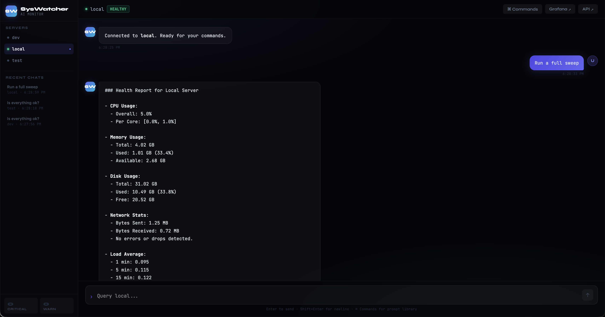
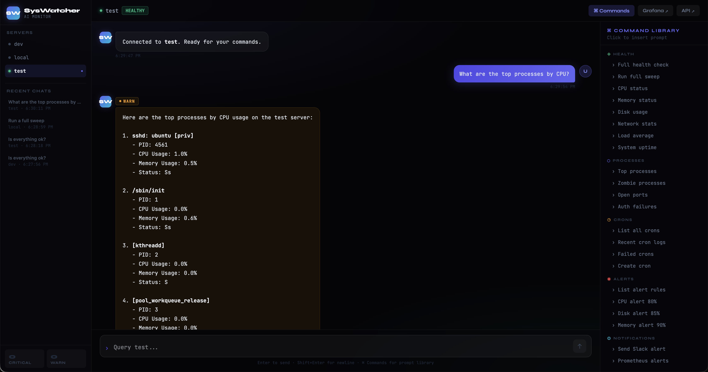
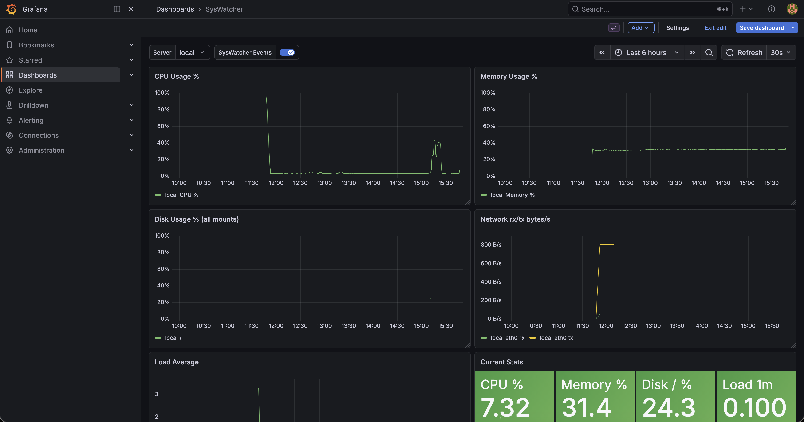
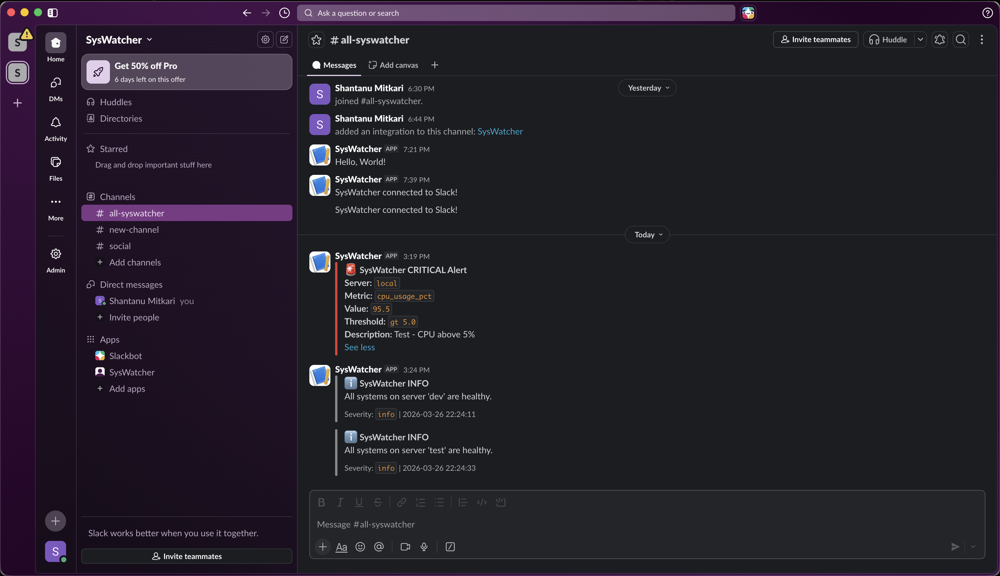
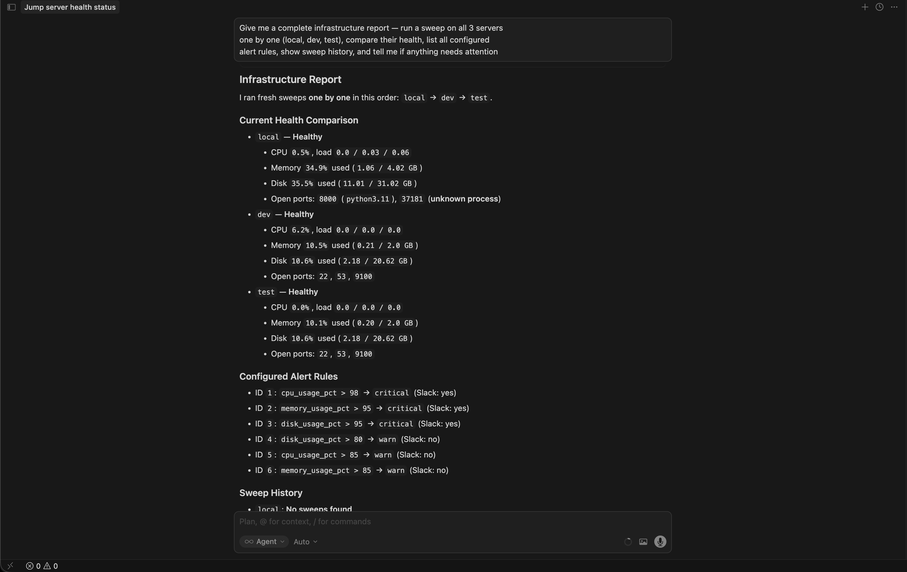
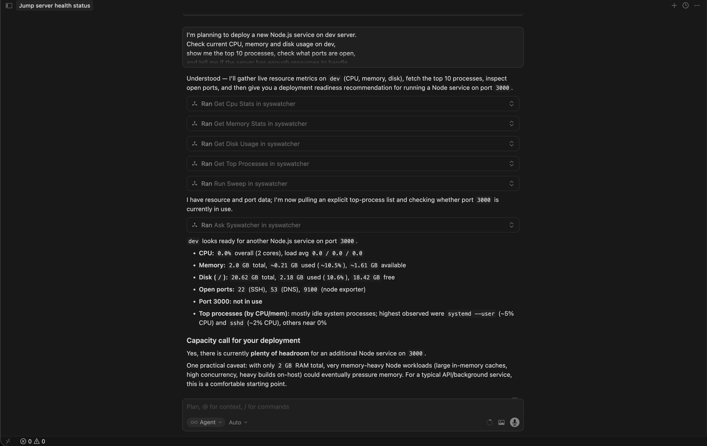

<div align="center">

```
███████╗██╗   ██╗███████╗██╗    ██╗ █████╗ ████████╗ ██████╗██╗  ██╗███████╗██████╗
██╔════╝╚██╗ ██╔╝██╔════╝██║    ██║██╔══██╗╚══██╔══╝██╔════╝██║  ██║██╔════╝██╔══██╗
███████╗ ╚████╔╝ ███████╗██║ █╗ ██║███████║   ██║   ██║     ███████║█████╗  ██████╔╝
╚════██║  ╚██╔╝  ╚════██║██║███╗██║██╔══██║   ██║   ██║     ██╔══██║██╔══╝  ██╔══██╗
███████║   ██║   ███████║╚███╔███╔╝██║  ██║   ██║   ╚██████╗██║  ██║███████╗██║  ██║
╚══════╝   ╚═╝   ╚══════╝ ╚══╝╚══╝ ╚═╝  ╚═╝   ╚═╝    ╚═════╝╚═╝  ╚═╝╚══════╝╚═╝  ╚═╝
```

**AI-Powered Server Health Monitoring Agent**

*Ask your infrastructure anything. In plain English.*

[](https://python.org)
[](https://fastapi.tiangolo.com)
[](https://langchain-ai.github.io/langgraph/)
[](https://nextjs.org)
[](https://docker.com)
[](https://aws.amazon.com)
[](https://prometheus.io)
[](https://grafana.com)

</div>

---

## What is SysWatcher?

SysWatcher is an **AI-powered server health monitoring agent** that lets you talk to your infrastructure in plain English. Instead of SSH-ing into servers, reading logs, running commands, and interpreting Prometheus queries yourself you just ask.

```
"Is everything ok on the dev server?"
"Did any cron jobs fail last night?"
"Why was the server slow at 3pm?"
"Compare CPU usage across all 3 servers"
"Alert me if disk goes above 80%"
```

SysWatcher uses a **LangGraph agentic pipeline** to understand your question, select the right tools, collect live data from your servers via SSH and Prometheus, analyze it, and give you a clear answer - all in seconds.

---

## Screenshots

### Chat UI - Talk to your servers in plain English

<div align="center">

<br/><em>Full health sweep on local server - CPU, memory, disk, network, load average</em>
</div>

<br/>

<div align="center">

<br/><em>Querying test server with Command Library open - 30+ prompts across 6 categories</em>
</div>

---

### Grafana Dashboard - Pre-wired, auto-provisioned

<div align="center">

<br/><em>8-panel dashboard - CPU, memory, disk, network, load average, current stats. Server dropdown to switch between monitored servers.</em>
</div>

---

### Slack Alerts - Critical events delivered instantly

<div align="center">

<br/><em>Real-time Slack alerts when thresholds are breached. Info/warn stored silently - only critical events notify.</em>
</div>

---

### Cursor Integration - Infrastructure-aware AI coding

<div align="center">

<br/><em>Cursor running a full infrastructure report across all 3 servers via SysWatcher MCP tools</em>
</div>

<br/>

<div align="center">

<br/><em>"I'm planning to deploy a Node.js service on dev - check if it has enough resources." Cursor calls SysWatcher tools and gives a deployment recommendation backed by live data.</em>
</div>

---

## Why SysWatcher is Different

### The Problem with Existing Tools

| Tool | What it does | What it doesn't do |
|------|-------------|-------------------|
| Grafana | Beautiful dashboards | Can't answer questions |
| Prometheus | Metrics collection | Requires PromQL knowledge |
| Datadog / New Relic | Full observability | Expensive, complex, not AI-native |
| ChatGPT + terminal | AI assistance | No live server access |
| PagerDuty | Alerting | Reactive, not conversational |

### What Makes SysWatcher Unique

**1. Natural Language Infrastructure Access**
No PromQL. No SSH. No grep. Just ask in plain English and get answers backed by live data.

**2. Cursor Integration via MCP**
> *"Cursor knows your code + SysWatcher knows your servers = AI that understands BOTH your codebase AND your infrastructure at the same time."*

SysWatcher exposes 66 tools via the Model Context Protocol (MCP). Connect it to Cursor and your AI coding assistant can now check if your dev server is healthy before you deploy, see what's consuming CPU while you debug, or create a cron job without leaving your editor.

**3. Agentic - Not Just Dashboards**
SysWatcher doesn't just display metrics. It **thinks**. The LangGraph pipeline classifies your intent, selects tools, collects data, analyzes findings, evaluates alert rules, posts Grafana annotations, and sends Slack notifications - all autonomously.

**4. 66 Tools Across 11 Domains**
From SSH-based system metrics to Prometheus trends, Grafana annotations, RCA reports, security audits, Docker stats, log analysis, and more - all callable from a single natural language interface.

**5. Silent Sweeps, Smart Alerts**
Sweeps every 5 minutes across all servers. Stores everything. Notifies you only when something actually matters (configurable thresholds). No alert fatigue.

**6. Production-Grade on AWS**
3 EC2 servers, Terraform-provisioned, Docker Compose orchestrated, Prometheus + Grafana pre-wired, node_exporter on all servers, everything behind proper security groups.

**7. Plug & Play - Zero Configuration Monitoring**
No agents to install manually. No dashboards to build. No alert rules to write in YAML. No per-server config files.

Add a new server in one command:

```bash
./manage.sh add-server prod-01 192.168.1.100 ubuntu ~/.ssh/id_rsa
```

SysWatcher automatically:
- SSHs in and installs `node_exporter`
- Updates `prometheus.yml` scrape config
- Reloads Prometheus live - no restart needed
- Registers the server in the database
- Starts sweeping it every 5 minutes
- Makes it available in the Chat UI server dropdown
- Exposes it to Cursor via MCP immediately

**The server is fully monitored in under 30 seconds.**

Same story on first install - `./install.sh` handles everything end to end. You fill in your OpenAI key and server IPs, and SysWatcher provisions, configures, and starts itself. No manual Docker commands, no manual Prometheus config, no manual Grafana setup.

---

## Architecture

```
+------------------------------------------------------------------+
|                        CLIENT LAYER                              |
|                                                                  |
|  +----------------------+     +------------------------------+   |
|  |  Chat UI             |     |  Cursor / Claude Desktop     |   |
|  |  Next.js :3001       |     |  (MCP Client)                |   |
|  +----------+-----------+     +---------------+--------------+   |
|             |                                 |                  |
+-------------|----------------------------------|------------------+
              |                                 |
+-------------|----------------------------------|------------------+
|             |           API LAYER             |                  |
|             v                                 v                  |
|  +-------------------+          +--------------------------+     |
|  |  FastAPI Agent    |<---------|  MCP Server :8080        |     |
|  |  :8000            |          |  66 tools via SSE        |     |
|  +---------+---------+          +--------------------------+     |
|            |                                                     |
+------------|-----------------------------------------------------+
             |
+------------|------------------------------------------------------+
|            |        AGENT PIPELINE (LangGraph)                    |
|            |                                                      |
|     +------v------+                                               |
|     | Classifier  |  intent: system/cron/logs/rca/security/...    |
|     +------+------+                                               |
|            |                                                      |
|     +------v------+                                               |
|     |   Collect   |  builds prompt + starts sweep record          |
|     +------+------+                                               |
|            |                                                      |
|     +------v------+                                               |
|     |   Analyze   |  LLM selects which tools to call              |
|     +------+------+                                               |
|            |                                                      |
|     +------v------+                                               |
|     |     Act     |  executes tools, extracts metrics             |
|     +------+------+                                               |
|            |                                                      |
|     +------v------+                                               |
|     |   Report    |  evaluates alerts, sends Slack, stores        |
|     +-------------+                                               |
|                                                                   |
+-------------------------------------------------------------------+
             |
+------------|------------------------------------------------------+
|            |        TOOL LAYER (66 tools, 11 groups)              |
|            |                                                      |
|  +---------+---------+-----------+-----------+-----------+        |
|  | System  |  Cron   |   Logs    | Prometheus|  Grafana  |        |
|  | 9 tools | 5 tools |  9 tools  | 11 tools  |  5 tools  |        |
|  +---------+---------+-----------+-----------+-----------+        |
|  |   RCA   | Security|    App    |  Alerts   |  Notify   |        |
|  | 2 tools | 10 tools|  8 tools  |  3 tools  |  2 tools  |        |
|  +---------+---------+-----------+-----------+-----------+        |
|                                                                   |
+-------------------------------------------------------------------+
             |
+------------|------------------------------------------------------+
|            |        INFRASTRUCTURE LAYER                          |
|            |                                                      |
|  +--------------------------+  +------------+  +------------+     |
|  | jump server (t3.medium)  |  | dev server |  |test server |     |
|  |                          |  | (t3.small) |  | (t3.small) |     |
|  | Docker Compose 8 svcs:   |  |            |  |            |     |
|  |  agent      :8000        |  | node_exp   |  | node_exp   |     |
|  |  ui         :3001        |  | :9100      |  | :9100      |     |
|  |  mcp        :8080        |  |            |  |            |     |
|  |  prometheus :9090        |  | 10.0.1.216 |  | 10.0.1.6   |     |
|  |  grafana    :3000        |  +------------+  +------------+     |
|  |  postgres   :5432        |                                     |
|  |  scheduler               |  Prometheus scrapes all 3           |
|  |  node_exporter           |  via private IPs every 15s          |
|  +--------------------------+                                     |
|                                                                   |
|  All in VPC 10.0.0.0/16  |  Terraform managed  |  AWS EC2         |
+-------------------------------------------------------------------+
             |
+------------|------------------------------------------------------+
|            |        DATA LAYER                                    |
|                                                                   |
|  +-------------------+  +------------------+  +---------------+   |
|  |   PostgreSQL      |  |   Prometheus     |  |   Grafana     |   |
|  |  events           |  |  30 day retain   |  |  dashboards   |   |
|  |  sweep_runs       |  |  15s scrape      |  |  annotations  |   |
|  |  alert_rules      |  |  3 targets       |  |  8 panels     |   |
|  |  cron_registry    |  |                  |  |               |   |
|  |  chat_sessions    |  |                  |  |               |   |
|  |  notifications    |  |                  |  |               |   |
|  +-------------------+  +------------------+  +---------------+   |
+-------------------------------------------------------------------+
```

### Services

| Service | Port | Purpose |
|---------|------|---------|
| **Agent** (FastAPI + LangGraph) | 8000 | Core AI agent, REST API |
| **UI** (Next.js) | 3001 | Chat interface |
| **MCP Server** | 8080 | Cursor/Claude Desktop integration |
| **Scheduler** | - | Silent 5-minute sweeps |
| **Prometheus** | 9090 | Metrics collection |
| **Grafana** | 3000 | Dashboards + annotations |
| **Postgres** | 5432 | Events, sweeps, alerts, sessions |
| **node_exporter** | 9100 | Server metrics (all 3 servers) |

---

## Quick Start

Getting SysWatcher running takes **3 commands and ~3 minutes**. Add any new server in **30 seconds** with one command.

### Prerequisites
- AWS account with EC2 access
- Terraform >= 1.5
- Docker + Docker Compose
- OpenAI API key

### Step 1 - Provision Infrastructure

```bash
cd terraform
cp terraform.tfvars.example terraform.tfvars
# Edit terraform.tfvars - set your aws_region and aws_profile
./deploy.sh apply
```

Creates 3 EC2 servers, VPC, security groups, SSH key pairs, and Elastic IPs automatically. Prints your server IPs and SSH commands when done.

### Step 2 - SSH into Jump Server

```bash
ssh -i terraform/keys/syswatcher-jump.pem ubuntu@<jump-ip>
```

### Step 3 - Clone & Run the Installer

```bash
git clone https://github.com/Shantanumtk/Syswatcher-Agentic-AI.git
cd Syswatcher-Agentic-AI
./install.sh
```

The installer handles **everything automatically**:

```
[1/6] Checking dependencies      - Docker, Docker Compose, git, python3
[2/6] Getting SysWatcher         - repo ready
[3/6] Configuration              - opens syswatcher.conf in your editor
[4/6] Generating config files    - creates .env and prometheus.yml
[5/6] Setting up remote servers  - SSHs in, installs node_exporter
[6/6] Starting SysWatcher        - docker compose up, waits for health,
                                   initializes Grafana token
      Done! Access URLs printed
```

You only need to fill in `syswatcher.conf` when it opens - add your OpenAI key, server IPs, and optionally Slack webhook. Everything else is fully automatic.

### syswatcher.conf

```ini
# Your monitored servers - format: name = IP  ssh_user  key_path
dev  = 10.0.1.216   ubuntu   /home/ubuntu/Syswatcher-Agentic-AI/terraform/keys/syswatcher-dev.pem
test = 10.0.1.6     ubuntu   /home/ubuntu/Syswatcher-Agentic-AI/terraform/keys/syswatcher-test.pem

# Required
OPENAI_API_KEY = sk-...

# Optional but recommended
SLACK_WEBHOOK_URL = https://hooks.slack.com/services/...
GRAFANA_ADMIN_PASSWORD = admin123
SWEEP_INTERVAL_MIN = 5
```

### Step 4 - Access

| Service | URL |
|---------|-----|
| **Chat UI** | http://\<jump-ip\>:3001 |
| **Grafana** | http://\<jump-ip\>:3000 (admin / admin123) |
| **Prometheus** | http://\<jump-ip\>:9090 |
| **API Docs** | http://\<jump-ip\>:8000/docs |
| **MCP Server** | http://\<jump-ip\>:8080 |

Open the Chat UI and ask your first question:

```
Is everything ok?
```

---

## manage.sh - Your Management CLI

Everything you need to manage SysWatcher day-to-day is in `manage.sh`:

```bash
# Check all service health at a glance
./manage.sh status

# Add a new server to monitor (plug and play - fully automated)
./manage.sh add-server prod-01 192.168.1.100 ubuntu ~/.ssh/id_rsa

# Remove a server
./manage.sh remove-server prod-01

# Trigger a manual health sweep
./manage.sh sweep dev

# Ask the agent directly from the command line
./manage.sh ask "is everything ok?"
./manage.sh ask "did any cron jobs fail last night?"
./manage.sh ask "compare CPU across all servers"
./manage.sh ask "run a full RCA report on dev"

# Tail live logs
./manage.sh logs agent
./manage.sh logs scheduler
./manage.sh logs mcp

# Backup Postgres to a .sql file
./manage.sh backup

# Restore from backup
./manage.sh restore syswatcher_backup_20260326.sql

# Restart a specific service or all services
./manage.sh restart agent
./manage.sh restart

# Stop / start everything
./manage.sh stop
./manage.sh start

# Pull latest code and rebuild
./manage.sh update
```

---

## Cursor Integration (MCP)

SysWatcher exposes all 66 tools via MCP so Cursor's AI can access your live infrastructure while you code.

### Setup - Cursor

Edit `~/.cursor/mcp.json`:

```json
{
  "mcpServers": {
    "syswatcher": {
      "url": "http://<jump-ip>:8080/sse",
      "headers": {
        "x-api-key": "syswatcher123"
      }
    }
  }
}
```

Restart Cursor → open MCP panel → see 66 SysWatcher tools listed.

### Setup - Claude Desktop

Edit `~/Library/Application Support/Claude/claude_desktop_config.json` (Mac) or `%APPDATA%\Claude\claude_desktop_config.json` (Windows):

```json
{
  "mcpServers": {
    "syswatcher": {
      "url": "http://<jump-ip>:8080/sse",
      "headers": {
        "x-api-key": "syswatcher123"
      }
    }
  }
}
```

Restart Claude Desktop. All 66 tools available.

### What This Unlocks

> **Cursor knows your code. SysWatcher knows your servers.**
> Together: AI that understands BOTH your codebase AND your infrastructure simultaneously.

Real Cursor conversations powered by SysWatcher:

> *"I'm planning to deploy a new Node.js service on dev server. Check current CPU, memory and disk, show me the top 10 processes, check what ports are open, and tell me if the server has enough resources."*

Cursor called `get_cpu_stats`, `get_memory_stats`, `get_disk_usage`, `get_top_processes`, `run_sweep` and gave a full deployment recommendation - port 3000 not in use, 1.61 GB RAM available, plenty of headroom.

> *"Give me a complete infrastructure report - run a sweep on all 3 servers, compare their health, list all configured alert rules, show sweep history, and tell me if anything needs attention."*

Cursor swept all 3 servers, compared metrics, listed 6 alert rules, and produced a full infrastructure report - all from your editor without leaving the codebase.

---

## Example Prompts

### Health Checks
```
Is everything ok?
Run a full sweep on dev server
What's the overall health of all 3 servers?
Show me the last 5 sweeps
```

### System Metrics
```
What's the CPU usage on dev server?
Show memory usage across all servers
Is disk filling up on any server?
What are the top 10 processes by CPU on test?
What's the load average on local?
Is the server swapping memory?
```

### Incident Investigation
```
Run a full RCA report on local server for the last 2 hours
What caused the slowness at 3pm today?
Show me the incident timeline for the last 6 hours on dev
Is there a memory leak on dev? Check the last 3 hours
Is disk I/O causing CPU slowness? Check iowait
Compare current metrics against 24 hour baseline - any deviations?
```

### Cron Jobs
```
List all cron jobs on local server
Did any cron jobs fail last night?
Create a cron job every day at 2am called db_backup that runs /opt/scripts/backup.sh and logs to /var/log/backup.log
Delete the cron job called old_cleanup on dev server
```

### Alert Rules
```
Show all alert rules
Add an alert if CPU goes above 80% with Slack notification
Add an alert if disk goes above 85% on dev server with Slack
Add a critical alert if memory goes above 90%
Delete alert rule 3
```

### Security
```
Are there any SSH brute force attacks on local server?
Who is currently logged in to the test server?
Show recent sudo commands on dev
Check if any services have failed on local
Show firewall rules on dev server
Check SSL certificate expiry
Find any world-writable files
```

### Docker & Applications
```
List all Docker containers on local server
Show Docker container CPU and memory usage
Is nginx running on dev server?
Check if port 3000 is open on local
Check if http://localhost:8000/health is responding
Show last 50 lines of nginx service logs
```

### Prometheus & Grafana
```
Compare CPU across all 3 servers - which is most loaded?
Show disk I/O rate on local server
Is disk causing CPU slowness? Check iowait percentage
Detect any anomalies in memory usage on dev
Check which servers Prometheus is monitoring
Show the Grafana event timeline for last 6 hours
```

### Logs
```
Show last 50 lines of /var/log/syslog on dev
Search for ERROR in /var/log/nginx/error.log
Are there any OOM out of memory events?
Show kernel messages from dmesg on test
Show auth failures from the last 24 hours
Get error summary from syslog
```

---

## 66 Tools Across 11 Groups

### System (9 tools)

| Tool | What it does |
|------|-------------|
| `get_cpu_stats` | CPU %, per-core, load average |
| `get_memory_stats` | RAM usage, swap, available |
| `get_disk_usage` | Disk usage per mount point |
| `get_network_stats` | Bytes sent/received, errors, drops |
| `get_top_processes` | Top N processes by CPU |
| `get_system_uptime` | Uptime, boot time |
| `get_load_average` | 1m, 5m, 15m load |
| `get_open_ports` | Listening ports + owning process |
| `get_swap_activity` | Swap in/out - detect thrashing |

### Cron (5 tools)

| Tool | What it does |
|------|-------------|
| `get_cron_jobs` | List all cron jobs |
| `get_cron_logs` | Recent cron execution logs |
| `get_failed_crons` | Jobs that failed |
| `create_cron_job` | Create new cron via SSH |
| `delete_cron_job` | Remove cron by name |

### Process (2 tools)

| Tool | What it does |
|------|-------------|
| `get_process_by_name` | Find process by name |
| `get_zombie_processes` | Detect defunct processes |

### Logs (9 tools)

| Tool | What it does |
|------|-------------|
| `tail_log_file` | Last N lines of any log file |
| `search_log_pattern` | grep across log files |
| `get_auth_failures` | Failed SSH/auth attempts |
| `get_error_summary` | Errors grouped by type + count |
| `get_oom_events` | OOM killer events |
| `get_kernel_messages` | dmesg output |
| `get_application_errors` | Multi-file error search |
| `get_log_volume_trend` | Log growth rate |
| `get_segfault_events` | Application crash events |

### Prometheus (11 tools)

| Tool | What it does |
|------|-------------|
| `query_prometheus_instant` | Any PromQL - current value |
| `query_prometheus_range` | PromQL over time range |
| `get_prometheus_alerts` | Firing alerts |
| `get_cpu_trend` | CPU trend with spike detection |
| `get_memory_trend` | Memory trend, leak detection |
| `get_disk_io_rate` | Disk read/write MB/s |
| `get_network_bandwidth` | Network Mbps per interface |
| `get_cpu_iowait` | I/O wait - disk bottleneck detection |
| `compare_server_metrics` | Same metric across all servers |
| `get_prometheus_targets` | Scrape target health |
| `get_metric_anomaly` | Spike detection vs baseline |

### Grafana (5 tools)

| Tool | What it does |
|------|-------------|
| `post_grafana_annotation` | Mark events on timeline |
| `get_grafana_annotations` | Fetch recent events |
| `get_annotations_timeline` | Incident timeline for RCA |
| `get_grafana_dashboard_list` | List dashboards |
| `get_grafana_health` | Grafana health check |

### RCA (2 tools)

| Tool | What it does |
|------|-------------|
| `get_rca_report` | Full root cause analysis - CPU, memory, disk, I/O, network, events |
| `get_system_baseline` | Current vs 24h baseline deviation |

### Security (10 tools)

| Tool | What it does |
|------|-------------|
| `get_failed_ssh_attempts` | Brute force detection |
| `get_active_sessions` | Who is logged in |
| `get_sudo_history` | Privileged command audit |
| `get_firewall_rules` | UFW / iptables rules |
| `get_ssl_cert_expiry` | Certificate expiry check |
| `get_listening_services` | Services on open ports |
| `get_recent_logins` | Login history |
| `get_world_writable_files` | Security misconfiguration |
| `get_failed_services` | Crashed systemd services |
| `get_service_status` | Status of specific service |

### Application (8 tools)

| Tool | What it does |
|------|-------------|
| `check_port_open` | Port connectivity check |
| `check_url_health` | HTTP health check with response time |
| `check_process_alive` | Is process running |
| `get_docker_containers` | Container list + status |
| `get_docker_stats` | Container CPU/memory |
| `get_service_logs` | journalctl output |
| `get_environment_check` | System limits + config |
| `check_disk_smart` | Disk hardware health |

### Alerts (3 tools)

| Tool | What it does |
|------|-------------|
| `create_alert_rule` | Create metric threshold alert |
| `list_alert_rules` | Show all active rules |
| `remove_alert_rule` | Delete alert by ID |

### Notification (2 tools)

| Tool | What it does |
|------|-------------|
| `send_slack_alert` | Send Slack message |
| `send_email_alert` | Send email alert |

---

## Infrastructure

```
AWS us-east-1
+-- VPC (10.0.0.0/16)
    +-- Public Subnet (10.0.1.0/24)
        +-- jump server  (t3.medium)   <-- SysWatcher runs here
        |   +-- Docker stack (8 containers)
        |   +-- Elastic IP: 18.206.108.14
        |   +-- Ports: 22, 3000, 3001, 8000, 8080, 9090
        |
        +-- dev server   (t3.small)    <-- monitored
        |   +-- node_exporter :9100
        |   +-- Private IP: 10.0.1.216
        |
        +-- test server  (t3.small)    <-- monitored
            +-- node_exporter :9100
            +-- Private IP: 10.0.1.6

Provisioned and managed by Terraform (terraform/)
```

---

## Deployment Workflow

Since `syswatcher.conf` contains your secrets and is gitignored, the safe workflow is:

```bash
# On Mac - make changes and push
git add .
git commit -m "feat: your change"
git push

# On jump server - pull without touching syswatcher.conf
git pull

# Agent - just restart (volume mounted, no rebuild needed)
docker compose restart agent

# Scheduler - stop+rm+up (env vars are baked at container creation time)
docker compose stop scheduler && docker compose rm -f scheduler && docker compose up -d scheduler

# MCP - rebuild required (not volume mounted)
docker compose stop mcp && docker compose rm -f mcp
docker compose build --no-cache mcp
docker compose up -d mcp
```

> **Important:** Always use `stop + rm + up` (not `restart`) for the scheduler after `.env` changes.
> Docker Compose bakes env vars at container creation time - restart alone won't pick up new values.

---

## Alert Rules

Default alert rules seeded on first run:

| Metric | Condition | Threshold | Severity | Notify |
|--------|-----------|-----------|----------|--------|
| cpu_usage_pct | gt | 98% | critical | Slack + Email |
| memory_usage_pct | gt | 95% | critical | Slack + Email |
| disk_usage_pct | gt | 95% | critical | Slack + Email |
| disk_usage_pct | gt | 80% | warn | Store only |
| cpu_usage_pct | gt | 85% | warn | Store only |
| memory_usage_pct | gt | 85% | warn | Store only |

Create custom alerts in plain English:
```
Add an alert if load average goes above 4 on dev server with Slack notification
Add a critical alert if disk on test server goes above 90%
```

---

## Tech Stack

| Layer | Technology |
|-------|-----------|
| **AI Agent** | LangGraph, LangChain, GPT-4o-mini |
| **API** | FastAPI, Uvicorn |
| **UI** | Next.js 14, TypeScript |
| **Database** | PostgreSQL 16, asyncpg, psycopg2 |
| **Metrics** | Prometheus, node_exporter |
| **Dashboards** | Grafana |
| **SSH** | Paramiko |
| **Scheduler** | APScheduler |
| **MCP** | Model Context Protocol (SSE transport) |
| **Infrastructure** | AWS EC2, Terraform, Docker Compose |
| **Notifications** | Slack Webhooks, SMTP |

---

## Project Structure

```
Syswatcher-Agentic-AI/
├── agent/
│   ├── graph/
│   │   ├── nodes/
│   │   │   ├── classifier.py     # Intent classification (11 intents)
│   │   │   ├── collect.py        # Context + sweep setup
│   │   │   ├── analyze.py        # LLM + tool binding
│   │   │   ├── act.py            # Tool execution
│   │   │   └── report.py         # Alert eval + Slack + DB write
│   │   ├── graph.py              # LangGraph pipeline
│   │   └── state.py              # AgentState definition
│   ├── tools/
│   │   ├── system_tools.py       # 9 system tools (SSH)
│   │   ├── cron_tools.py         # 5 cron tools (SSH)
│   │   ├── process_tools.py      # 2 process tools
│   │   ├── log_tools.py          # 9 log tools (SSH)
│   │   ├── prometheus_tools.py   # 11 Prometheus tools
│   │   ├── grafana_tools.py      # 5 Grafana tools
│   │   ├── rca_tools.py          # 2 RCA tools
│   │   ├── security_tools.py     # 10 security tools (SSH)
│   │   ├── application_tools.py  # 8 application tools (SSH)
│   │   ├── alert_rules_tools.py  # 3 alert tools
│   │   ├── notification_tools.py # 2 notification tools
│   │   └── registry.py           # Tool groups + intent mapping
│   ├── api/routes/               # FastAPI routes
│   ├── db/                       # Postgres queries (asyncpg)
│   ├── config.py                 # Settings (pydantic)
│   └── main.py                   # FastAPI app + lifespan
├── mcp/
│   └── mcp_server.py             # MCP server - 66 tools via SSE
├── ui/
│   ├── pages/index.tsx           # Main layout + TopBar
│   ├── components/
│   │   ├── ChatPanel.tsx         # Chat interface + typing indicator
│   │   ├── Sidebar.tsx           # Server list + chat history
│   │   └── PromptsPanel.tsx      # Command library (30+ prompts)
│   └── lib/api.ts                # API client
├── scheduler/
│   └── scheduler.py              # APScheduler - 5 min sweeps
├── prometheus/
│   ├── prometheus.yml            # Scrape config (all 3 servers)
│   └── rules/node_alerts.yml     # Alert rules
├── grafana/
│   └── provisioning/             # Auto-provisioned dashboards
├── postgres/init/
│   └── 01_schema.sql             # Full schema + seed alert rules
├── terraform/
│   ├── main.tf                   # EC2, VPC, SGs, SSH keys, EIPs
│   ├── variables.tf
│   ├── outputs.tf
│   └── deploy.sh                 # One-command deploy
├── scripts/
│   ├── generate_configs.py       # syswatcher.conf -> .env + prometheus.yml
│   ├── grafana_init.py           # Grafana service account setup
│   └── install_node_exporter.sh  # Remote server bootstrap
├── docs/
│   └── screenshots/              # README screenshots
├── docker-compose.yml            # 8 services
├── syswatcher.conf               # Your config (gitignored)
├── install.sh                    # One-command installer
└── manage.sh                     # Management CLI
```

---

## API Reference

```http
POST /ask
{"question": "is everything ok?", "server_name": "local"}

POST /sweep
{"server_name": "dev"}

GET  /status?server_name=local&mins_back=5

GET  /servers
POST /servers
{"name": "prod-01", "ip": "1.2.3.4", "ssh_user": "ubuntu", "ssh_key_path": "/path/to/key.pem"}

GET  /alerts
POST /alerts
{"metric": "cpu_usage_pct", "condition": "gt", "threshold": 80.0, "severity": "critical", "notify_slack": true}
DELETE /alerts/{rule_id}

GET  /history/events?server_name=local&severity=critical&limit=20
GET  /history/sweeps?server_name=local&limit=10

GET  /crons?server_name=local
POST /crons
DELETE /crons/{server_name}/{name}
```

Full interactive docs: `http://<jump-ip>:8000/docs`

---

## Roadmap

- [ ] **Auto-remediation** - Safe whitelist of actions (restart service, clear cache, free disk)
- [ ] **Scheduled Slack reports** - CPU/memory/disk summary every N hours
- [ ] **DBWatcher** - Database monitoring (Postgres + Oracle)
- [ ] **Multi-agent sweeps** - Parallel sweeps per server
- [ ] **RAG on runbooks** - Agent reads your playbooks to suggest specific fixes
- [ ] **WatcherAI platform** - CI/CD, Security, Cost, Kubernetes, ML watchers

---

## Contributing

```bash
git clone https://github.com/Shantanumtk/Syswatcher-Agentic-AI.git
cd Syswatcher-Agentic-AI

# Edit syswatcher.conf with your OpenAI key and server details
./install.sh
```

Open http://localhost:3001 and start asking questions.

---

## License

MIT License - see [LICENSE](LICENSE)

---

<div align="center">

Built by [Shantanu](https://github.com/Shantanumtk)

*Infrastructure monitoring that speaks human.*

**Star this repo if SysWatcher saved you time**

</div>